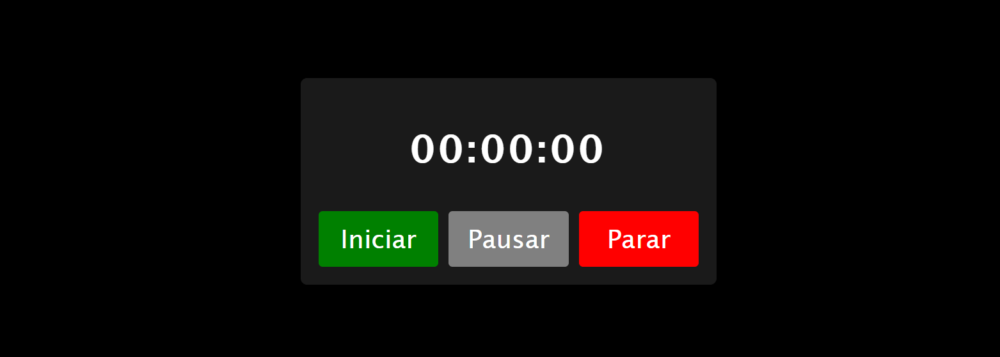

## Cronômetro com HTML, CSS e JAVASCRIPT

### 🌐 Fonte
Vídeo [Criando um cronômetro com JavaScript](https://youtu.be/msyTjg3t4Z8?si=e0zCxHGGHrW4Clh3) do Leo Ujo

### 📸 Screenshot


### 🛠️ Tecnologias ultilizadas


### 🧠 O que aprendi 
Aprendi a usar as funções ```onclick```, ```setInterval``` e ```clearInterval```;
